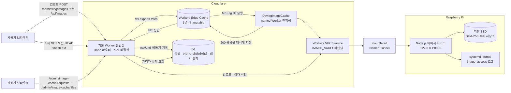
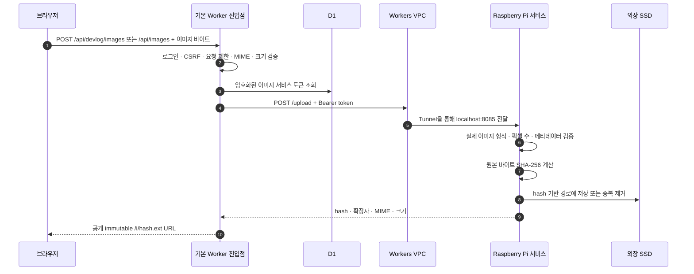
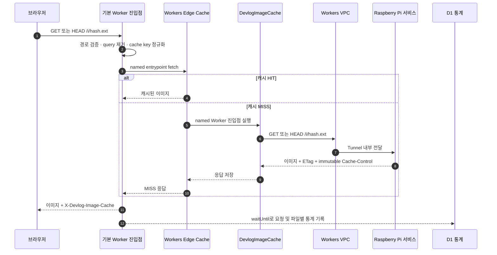

# 이미지 첨부 서비스 아키텍처

CodexBoard의 자유게시판·개발일지 첨부 이미지와 개인 이미지 저장소는 하나의 통합 이미지 경로를 사용합니다. Cloudflare Worker를 공개 진입점으로 사용하고, Workers VPC와 Cloudflare Tunnel을 통해 Raspberry Pi의 외장 SSD에 저장합니다. 파일명은 원본 바이트의 SHA-256 해시이므로 동일 URL의 내용은 바뀌지 않습니다.

## 전체 구성



## 업로드 흐름



업로드 API는 인증된 사용자만 호출할 수 있습니다. 브라우저는 Raspberry Pi의 주소나 서비스 토큰을 알지 못하며, Worker가 D1에 암호화해 둔 토큰을 복호화하여 VPC 내부 요청에만 사용합니다.

## 이미지 조회와 캐시 흐름



- 기본 Worker 진입점은 캐시하지 않으므로 모든 이미지 요청에서 라우팅과 통계 기록이 실행됩니다.
- `DevlogImageCache` named 진입점만 캐시합니다. HIT이면 Raspberry Pi와 VPC를 호출하지 않습니다.
- 기존 `/devlog-images/i/<hash>.<ext>` 주소는 `/i/<hash>.<ext>`로 308 리다이렉트됩니다.
- 캐시 키에서 query string을 제거하므로 같은 해시 파일은 하나의 캐시 항목을 공유합니다.
- 응답은 `Cache-Control: public, max-age=31536000, immutable`과 해시 기반 `ETag`를 사용합니다.
- `cross_version_cache`가 활성화되어 Worker를 다시 배포해도 유효한 이미지 캐시를 재사용합니다.
- 404, 405, 503 응답은 `no-store`로 반환하여 오류 응답이 캐시에 남지 않게 합니다.
- `If-None-Match`는 바깥 진입점에서 처리하므로 콜드 캐시도 Raspberry Pi의 304 응답만 받고 끝나지 않고 전체 본문을 채울 수 있습니다.

## 통계와 운영 확인

기본 Worker는 이미지 응답과 별개로 D1 기록을 `waitUntil()`에 맡깁니다. 통계 저장 장애가 이미지 표시를 막지는 않지만, 장애 중 일부 기록은 빠질 수 있는 best-effort 통계입니다.

| 화면 또는 로그 | 내용 |
|---|---|
| `/admin/image-cache/requests` | 최근 통합 이미지 요청 최대 1,000건의 시간, GET/HEAD, HIT/MISS, 응답 상태, 처리 시간, Colo |
| `/admin/image-cache/files` | 파일별 누적 요청, HIT, MISS, 히트율, 최근 결과 |
| 응답 `X-Devlog-Image-Cache` | 바깥 Worker가 기록한 `HIT` 또는 `MISS` |
| 응답 `Cf-Cache-Status` | Cloudflare가 반환한 원본 캐시 상태 |
| Raspberry Pi journal | 실제 Pi까지 도달한 `image_access` 요청 |

Raspberry Pi에서 실제 원본 조회를 실시간으로 확인하려면 다음 명령을 사용합니다.

```bash
sudo journalctl -u codexboard-image-service -f -o cat \
  | grep --line-buffered '"event":"image_access"'
```

## 보안 경계

- Raspberry Pi 서비스는 `127.0.0.1:8085`에서만 수신합니다.
- Tunnel에는 공개 hostname이나 공개 route가 필요하지 않습니다.
- 업로드와 삭제는 Bearer token을 요구하며, 공개 이미지 조회만 GET/HEAD를 허용합니다.
- 브라우저 업로드는 Worker의 로그인, CSRF, rate limit 검사를 통과해야 합니다.
- Worker는 허용된 이미지 MIME, 확장자, 크기를 검사하고 Pi 서비스는 실제 파일 형식을 다시 검증합니다.
